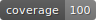

# superwand
[](https://badge.fury.io/py/superwand)
[](https://coveralls.io/github/juleshenry/superwand?branch=main)


`superwand` is a powerful posterization and color retheming tool that acts like a "magic wand" for images and CSS. It allows you to breathe new life into images (especially vector art and posterized graphics) by injecting gradients, enforcing color themes, or dynamically updating CSS stylesheets.

## Features
- **Gradient Injection**: Replace solid color regions with customizable gradients (radial, linear).
- **Automatic Gradient Enforcement**: Automatically identify prominent regions and apply gradients for a polished look.
- **CSS Retheming**: Dynamically update CSS color schemes based on predefined or custom themes.
- **Image Retheming**: Apply consistent color themes to your images with a single command.
- **Predefined Themes**: Includes 10+ professional color themes like Neon, Urban, Tropical, and more.

## Installation
```bash
pip install superwand
```

## Quick Start

### 1. Apply a Color Theme to an Image
Use the `superwand` command to instantly retheme an image:
```bash
superwand input.png -theme Urban
```

### 2. Inject Gradients Manually
Replace specific colors with gradients using `gradient_injector.py`:
```bash
python3 src/superwand/gradient_injector.py --input image.png --color "#FFFFFF" --gradient radial --start "#FF0000" --end "#0000FF"
```

### 3. Automatically Enforce Gradients
Let `superwand` decide where to put the magic:
```bash
python3 src/superwand/gradient_enforce.py input.png --style vertical --completeness aggressive
```

### 4. Retheme CSS Stylesheets
Update your website's look in seconds:
```bash
python3 src/superwand/css_rethemer.py site.css 'Tropical'
```

## Development
```bash
pip install -e .[dev]
```

## Testing
```bash
pytest
```

Color themes included:
<table>
  <tr>
    <td></td>
    <td></td>
    <td></td>
    <td></td>
    <td>
  </tr>
  <tr>
    <td></td>
    <td></td>
    <td></td>
    <td>
    <td>
   </tr>
</table>

## Theme Descriptions
- **Spring**: Fresh greens, yellows, and light blues for a vibrant, natural feel.
- **Summer**: Warm oranges, reds, and blues evoking sunny beach vibes.
- **Fall**: Earthy reds, oranges, and browns like autumn leaves.
- **Winter**: Cool whites, blues, and silvers for icy, crisp aesthetics.
- **Arctic**: Pale whites and icy blues for polar-inspired designs.
- **Safari**: Browns, tans, and greens mimicking savanna landscapes.
- **Urban**: Grays, blacks, and metallics for city street styles.
- **Neon**: Electric pinks, cyans, and yellows for glowing, futuristic looks.
- **Tropical**: Bright pinks, blues, and purples for exotic, island themes.
- **Paixão**: Passionate reds, purples, and golds for intense, romantic palettes.

## Adding Custom Themes
To create your own theme, modify the `color_themes` dictionary in `__color_themes__.py`. Add a new key with a list of RGB color tuples (0-255).

Example:
```python
"MyCustomTheme": [(255, 100, 0), (0, 200, 100), (150, 50, 255)],
```

Then, use it: `superwand image.png -theme MyCustomTheme`. Contributions welcome!

Examples applied to Charizard:

<table>
  <tr>
    <td></td>
    <td></td>
    <td></td>
    <td></td>
    <td></td>
  </tr>
  <tr>
    <td></td>
    <td></td>
    <td></td>
    <td></td>
    <td></td>
  </tr>
</table>

Some other fun examples:
<table>
  <tr>
    <td></td>
    <td></td>
  </tr>
  <tr>
    <td></td>
    <td></td>
  </tr>
</table>

# More Examples

## Rio
<table>
  <tr>
    <td></td>
    <td></td>
    <td></td>
    <td></td>
  </tr>
</table>

## Plankton
<table>
  <tr>
    <td></td>
    <td></td>
    <td></td>
    <td></td>
  </tr>
</table>

## Sad
<table>
  <tr>
    <td></td>
    <td></td>
    <td></td>
    <td></td>
  </tr>
</table>

## IMG_7609
<table>
  <tr>
    <td></td>
    <td></td>
    <td></td>
  </tr>
</table>
