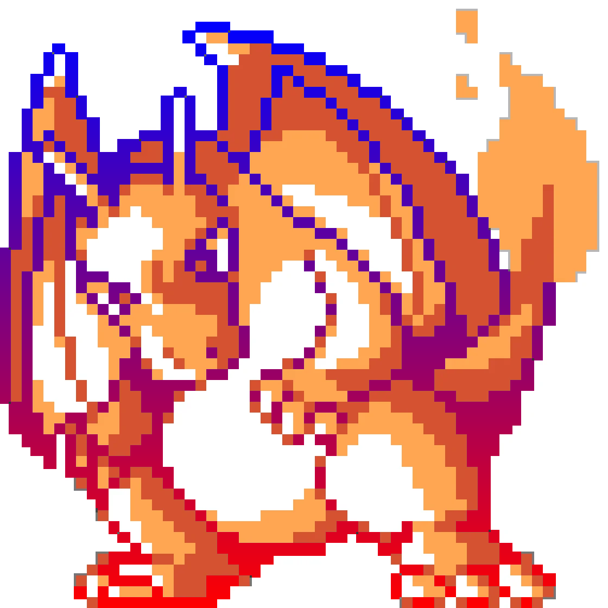

# superwand
Leverage magic wand to breath life to images, especially posterized and vector art images.

## Setup
```bash
pip install .
```

## CLI Usage

### Apply a Theme
```bash
superwand examples/images/zebra.png -theme Urban
```

## SuperWand Studio

The SuperWand Studio provides an interactive web interface for real-time image retheming, CSS retheming, and gradient application.

### Running the Studio

1. **Setup Environment:**
   It is recommended to use a virtual environment:
   ```bash
   python3 -m venv venv
   source venv/bin/activate
   pip install . flask scikit-learn
   ```

2. **Start the Server:**
   Run the studio application from the root directory:
   ```bash
   export PYTHONPATH=$(pwd)/src
   python studio/app.py
   ```

3. **Access the UI:**
   Open your browser and navigate to `http://127.0.0.1:5001`.

### Features
- **Real-time Image Processing:** Upload an image and adjust the number of regions ($k$) and color matching tolerance.
- **Flood Logic:** Toggle "Aggressive" flooding to fill gaps in complex regions using morphological operations.
- **Custom Palettes:** Use dynamic color pickers or select from creative presets like **Cyberpunk**, **Vaporwave**, or **Retro80s**.
- **CSS Rethemer:** Upload a `.css` file and apply the active palette to it instantly.
- **Gradient Overlay:** Apply directional (Vertical, Horizontal) or Radial gradients to identified color regions.

### Enforce Gradients
```bash
gradient-enforce examples/images/charizard.png --style radial
```

## Gradients
Included: `bottom-up`, `top-down`, `left-right`, `right-left`, `radial`

<table>
  <tr>
    <td></td>
    <td></td>
    <td></td>
    <td></td>
    <td></td>
  </tr>
</table>

## CSS Retheming
Identify color schemes in CSS and replace with a theme.

<table>
  <tr>
    <td></td>
    <td></td>
  </tr>
  <tr>
    <td></td>
    <td></td>
  </tr>
</table>

## Color Themes
Themes included:

<table>
  <tr>
    <td></td>
    <td></td>
    <td></td>
    <td></td>
    <td></td>
  </tr>
  <tr>
    <td></td>
    <td></td>
    <td></td>
    <td></td>
    <td></td>
  </tr>
</table>

### Example: Charizard

<table>
  <tr>
    <td></td>
    <td></td>
    <td></td>
    <td></td>
    <td></td>
  </tr>
  <tr>
    <td></td>
    <td></td>
    <td></td>
    <td></td>
    <td></td>
  </tr>
</table>

## Gallery

### Erro Xota
<table>
  <tr>
    <td></td>
    <td></td>
    <td></td>
    <td></td>
    <td></td>
  </tr>
</table>

### Plankt
<table>
  <tr>
    <td></td>
    <td></td>
    <td></td>
    <td></td>
    <td></td>
  </tr>
</table>

### Rio 07
<table>
  <tr>
    <td></td>
    <td></td>
    <td></td>
    <td></td>
    <td></td>
  </tr>
</table>
